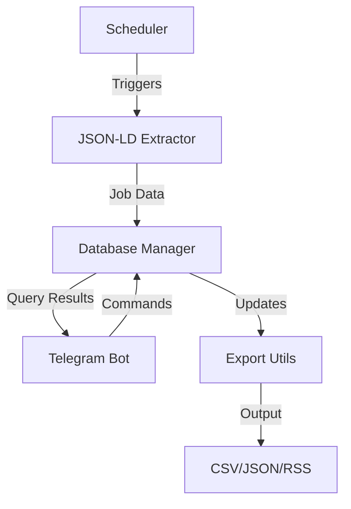

# Workday Scraper Implementation Details

## Architecture Overview

The Workday Scraper is built with a modular architecture that separates concerns and provides robust control over the scraping process:

### Core Components

1. **JSON-LD Extraction (`jsonld_extractor.py`)**
   - Uses structured data embedded in Workday pages
   - 10-20x faster than traditional browser-based scraping
   - Fallback to Playwright for complex cases
   - Robust error handling and retry logic

2. **Database Management (`db_manager.py`)**
   - SQLite for portable data storage
   - Optimized query patterns
   - Automatic backup and recovery
   - Transaction support for data integrity

3. **Telegram Bot Interface (`telegram_bot.py`)**
   - Real-time notifications
   - Interactive commands
   - Job search and filtering
   - Location-based queries

4. **Scheduler System (`scheduler.py`)**
   - Configurable run intervals
   - Timezone support
   - Failure recovery
   - Status monitoring

### Data Flow



## Key Features

### 1. Efficient Job Extraction
- JSON-LD structured data extraction
- Parallel processing with configurable workers
- Automatic rate limiting and retry logic
- Session management for optimal performance

### 2. Robust Data Management
- Atomic database operations
- Automatic schema updates
- Data deduplication
- Backup and recovery procedures

### 3. User Interface
- Command-based interaction
- Real-time notifications
- Job search capabilities
- Location-based filtering
- Customizable scheduling

## Data Models

### Job Schema
```sql
CREATE TABLE jobs (
    id INTEGER PRIMARY KEY AUTOINCREMENT,
    job_id TEXT NOT NULL,
    title TEXT NOT NULL,
    description TEXT,
    date_posted TEXT,
    employment_type TEXT,
    location TEXT,
    company_id INTEGER NOT NULL,
    url TEXT NOT NULL,
    timestamp TEXT NOT NULL,
    created_at TEXT NOT NULL,
    FOREIGN KEY (company_id) REFERENCES companies (id),
    UNIQUE (job_id, company_id)
)
```

### Company Schema
```sql
CREATE TABLE companies (
    id INTEGER PRIMARY KEY AUTOINCREMENT,
    name TEXT NOT NULL UNIQUE,
    url TEXT NOT NULL,
    created_at TEXT NOT NULL
)
```

## Error Handling

1. **Network Errors**
   - Exponential backoff
   - Session recovery
   - Alternative URL formats

2. **Data Validation**
   - Schema validation
   - Required field checks
   - Data type verification

3. **Resource Management**
   - Connection pooling
   - Worker thread limits
   - Memory usage optimization

## Configuration

### Environment Variables
- `DB_FILE`: Database location
- `CONFIG_DIR`: Configuration directory
- `LOG_DIR`: Log file location
- `TELEGRAM_BOT_TOKEN`: Bot authentication
- `TELEGRAM_CHAT_ID`: Notification target

### Command Line Options
- `-f, --file`: Config file name
- `-i, --initial`: Full scrape mode
- `-db, --db-file`: Database path
- `-mw, --max-workers`: Concurrency control
- `-ll, --log-level`: Logging verbosity

## Performance Optimization

1. **Database Optimizations**
   - Indexed queries
   - Prepared statements
   - Connection pooling
   - WAL journal mode

2. **Network Optimizations**
   - Connection reuse
   - Parallel requests
   - Response caching
   - Compressed transfers

3. **Memory Management**
   - Batch processing
   - Stream processing
   - Resource cleanup
   - Memory limits

## Testing Strategy

1. **Unit Tests**
   - Component isolation
   - Mock interfaces
   - Edge cases
   - Error conditions

2. **Integration Tests**
   - Component interaction
   - Data flow validation
   - Error propagation
   - Recovery procedures

3. **System Tests**
   - End-to-end validation
   - Performance metrics
   - Resource usage
   - Stability checks

## Deployment

### Docker Support
- Multi-stage builds
- Volume management
- Environment configuration
- Resource limits

### Monitoring
- Logging integration
- Error tracking
- Performance metrics
- Status reporting

## Security Considerations

1. **Data Protection**
   - Secure storage
   - Access control
   - Data encryption
   - Backup security

2. **API Security**
   - Rate limiting
   - Token management
   - Request validation
   - Error handling

## Maintenance

1. **Backup Procedures**
   - Automated backups
   - Version control
   - Data recovery
   - Schema updates

2. **Monitoring**
   - Log analysis
   - Error tracking
   - Performance metrics
   - Resource usage