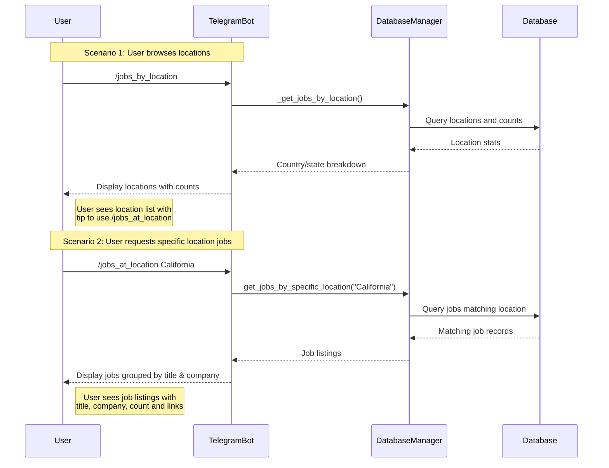
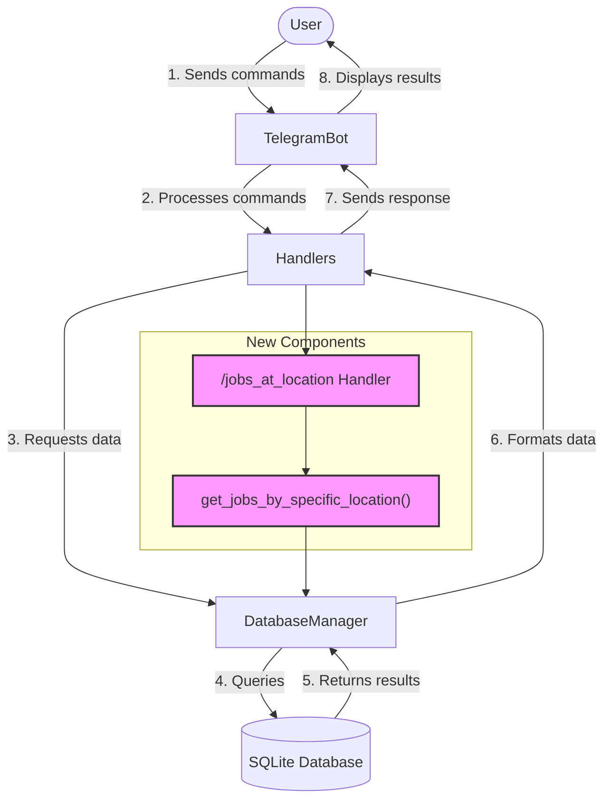

# Implementation Diagrams and Details

## Sequence Diagram: User Flow

## Component Interaction

## Files to Modify

1. `workday_scraper/db_manager.py`
   - Add new method: `get_jobs_by_specific_location(location: str)`

2. `workday_scraper/telegram_bot.py`
   - Add new handler: `handle_jobs_at_location(update, context)`
   - Update `initialize()` to register new handler
   - Update `handle_help()` to include new command
   - Modify `handle_jobs_by_location()` to add usage hint

## Implementation Alternatives Considered

### Alternative 1: Add buttons to `/jobs_by_location` output
- **Pros**: Direct interaction without typing commands
- **Cons**: Too many buttons for many locations, clutters the UI

### Alternative 2: Implement fuzzy matching for location names
- **Pros**: More forgiving of typos and partial names
- **Cons**: Might return unexpected results, additional complexity

### Alternative 3: Add pagination to job results
- **Pros**: Handles large result sets better
- **Cons**: More complex UI, might be confusing for users

### Chosen Solution: New command with partial matching
- **Pros**: Clean UI, familiar command pattern, supports partial location names
- **Cons**: Requires typing a command (mitigated by copy-paste from location list)