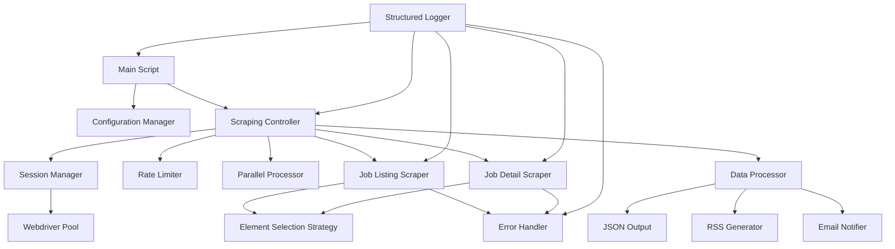

# Workday Scraper Project Improvement Plan

## Current State Analysis

The Workday Scraper is a Python-based web scraping tool designed to extract job postings from Workday-based career sites. It consists of two main implementations:

1. **Original Script** (`workday_scraper/__main__.py`): The core implementation with basic functionality.
2. **Enhanced Script** (`workday_scraper_enhanced.py`): An improved version with better error handling and debugging capabilities.

While the enhanced script successfully navigates through pagination and identifies job listings, it encounters several issues that prevent it from reliably scraping all available jobs.

## Key Issues Identified

1. **Brittle XPath Selectors**: The current selectors frequently fail with "no such element" exceptions.
2. **Inadequate Error Handling**: The script doesn't properly recover from element location failures.
3. **No Rate Limiting**: Aggressive scraping may trigger rate limiting or IP blocking.
4. **Excessive Parallel Processing**: The multiprocessing pool may create too many simultaneous connections.
5. **Poor Session Management**: Session state isn't properly maintained across page navigations.
6. **Limited Logging**: Current logging is insufficient for debugging complex issues.

## Improvement Plan

### 1. Robust Element Selection Strategy

#### Current Issue
The script relies on rigid XPath selectors that fail when page structure changes slightly:
```python
job_title_element = job_element.find_element(By.XPATH, ".//h3/a")
```

#### Proposed Solution
Implement a multi-layered element selection strategy:

```python
def find_element_with_fallbacks(parent, selectors_list, max_retries=3):
    """Try multiple selectors with retries to find an element."""
    for attempt in range(max_retries):
        for selector_type, selector in selectors_list:
            try:
                return parent.find_element(selector_type, selector)
            except NoSuchElementException:
                continue
        # Wait before retry
        time.sleep(1 * (attempt + 1))  # Exponential backoff
    raise ElementNotFoundError(f"Failed to find element after {max_retries} attempts with {len(selectors_list)} selectors")

# Usage example
job_title_selectors = [
    (By.XPATH, ".//h3/a"),
    (By.CSS_SELECTOR, "h3 a"),
    (By.XPATH, ".//a[@data-automation-id='jobTitle']"),
    (By.CSS_SELECTOR, "[data-automation-id='jobTitle']")
]

try:
    job_title_element = find_element_with_fallbacks(job_element, job_title_selectors)
except ElementNotFoundError as e:
    logger.error(f"Could not find job title: {e}")
    # Fallback behavior or skip
```

### 2. Comprehensive Error Handling Framework

#### Current Issue
The script has basic try-except blocks but doesn't implement proper recovery strategies:
```python
try:
    job_title_element = job_element.find_element(By.XPATH, ".//h3/a")
except Exception as e:
    print(f"Error processing job element: {str(e)}")
    continue
```

#### Proposed Solution
Implement a more sophisticated error handling framework:

```python
class ScraperError(Exception):
    """Base class for scraper exceptions."""
    pass

class ElementNotFoundError(ScraperError):
    """Raised when an element cannot be found."""
    pass

class PageLoadError(ScraperError):
    """Raised when a page fails to load properly."""
    pass

class RateLimitError(ScraperError):
    """Raised when rate limiting is detected."""
    pass

def handle_scraping_error(error, context, retry_function=None, max_retries=3):
    """Centralized error handling with context-aware recovery strategies."""
    if isinstance(error, NoSuchElementException):
        logger.warning(f"Element not found in {context}: {error}")
        if retry_function and max_retries > 0:
            logger.info(f"Retrying {context}, {max_retries} attempts left")
            time.sleep(2)  # Backoff before retry
            return retry_function(max_retries - 1)
    elif isinstance(error, TimeoutException):
        logger.error(f"Timeout in {context}: {error}")
        # Maybe take a screenshot for debugging
        if retry_function and max_retries > 0:
            logger.info(f"Retrying {context} after timeout, {max_retries} attempts left")
            time.sleep(5)  # Longer backoff for timeouts
            return retry_function(max_retries - 1)
    elif "rate limit" in str(error).lower():
        logger.critical(f"Rate limit detected: {error}")
        time.sleep(60)  # Long backoff for rate limits
        if retry_function and max_retries > 0:
            return retry_function(max_retries - 1)
    else:
        logger.error(f"Unexpected error in {context}: {error}")
        # Log full traceback for unexpected errors
        logger.debug(traceback.format_exc())
    
    return None  # Default fallback return value
```

### 3. Intelligent Rate Limiting

#### Current Issue
The script makes requests as fast as possible with no consideration for rate limits:
```python
for job_element in job_elements:
    # Process immediately
```

#### Proposed Solution
Implement adaptive rate limiting with exponential backoff:

```python
class AdaptiveRateLimiter:
    """Rate limiter with adaptive delay based on response patterns."""
    
    def __init__(self, initial_delay=1.0, max_delay=30.0, backoff_factor=1.5):
        self.current_delay = initial_delay
        self.max_delay = max_delay
        self.backoff_factor = backoff_factor
        self.success_count = 0
        self.failure_count = 0
        self.last_request_time = 0
    
    def wait(self):
        """Wait appropriate time before next request."""
        now = time.time()
        elapsed = now - self.last_request_time
        
        if elapsed < self.current_delay:
            time.sleep(self.current_delay - elapsed)
        
        self.last_request_time = time.time()
    
    def success(self):
        """Record successful request and potentially reduce delay."""
        self.success_count += 1
        self.failure_count = 0
        
        # After 10 consecutive successes, cautiously reduce delay
        if self.success_count >= 10:
            self.current_delay = max(self.current_delay / 1.2, 1.0)
            self.success_count = 0
    
    def failure(self, error_type=None):
        """Record failed request and increase delay."""
        self.failure_count += 1
        self.success_count = 0
        
        # Increase delay, more aggressively for certain error types
        multiplier = 2.0 if error_type == "rate_limit" else self.backoff_factor
        self.current_delay = min(self.current_delay * multiplier, self.max_delay)
        
        logger.info(f"Rate limiter: increased delay to {self.current_delay:.2f}s")

# Usage
rate_limiter = AdaptiveRateLimiter()

for job_element in job_elements:
    rate_limiter.wait()
    try:
        # Process job
        rate_limiter.success()
    except Exception as e:
        if "rate limit" in str(e).lower():
            rate_limiter.failure("rate_limit")
        else:
            rate_limiter.failure()
        # Handle error
```

### 4. Optimized Parallel Processing

#### Current Issue
The script uses a multiprocessing pool without size control:
```python
with multiprocessing.Pool() as pool:
    # Process all jobs in parallel
```

#### Proposed Solution
Implement a controlled parallel processing approach:

```python
def scrape_with_controlled_parallelism(jobs_to_scrape, max_workers=5, chunk_size=10):
    """Scrape jobs with controlled parallelism and chunking."""
    results = []
    
    # Process in chunks to avoid overwhelming the server
    for i in range(0, len(jobs_to_scrape), chunk_size):
        chunk = jobs_to_scrape[i:i+chunk_size]
        logger.info(f"Processing chunk {i//chunk_size + 1}/{math.ceil(len(jobs_to_scrape)/chunk_size)}")
        
        with multiprocessing.Pool(min(max_workers, len(chunk))) as pool:
            chunk_results = []
            for job_info in pool.starmap(scrape_job_posting, 
                                        [(job, company, url) for job in chunk]):
                if job_info:
                    chunk_results.append(job_info)
            
            results.extend(chunk_results)
        
        # Wait between chunks to avoid overwhelming the server
        time.sleep(5)
    
    return results
```

### 5. Improved Session Management

#### Current Issue
The script creates a new browser session for each job detail page:
```python
driver = get_driver()
driver.get(job_href)
# ... process ...
driver.close()
```

#### Proposed Solution
Implement a session manager to reuse and properly manage sessions:

```python
class WebdriverSessionManager:
    """Manages a pool of webdriver sessions for efficient reuse."""
    
    def __init__(self, max_sessions=3, session_timeout=300):
        self.sessions = []
        self.max_sessions = max_sessions
        self.session_timeout = session_timeout
        self.session_lock = threading.Lock()
    
    def get_session(self):
        """Get an available session or create a new one if needed."""
        with self.session_lock:
            # Clean up expired or crashed sessions
            self._cleanup_sessions()
            
            # Return an available session if any
            for session in self.sessions:
                if not session['in_use']:
                    session['in_use'] = True
                    session['last_used'] = time.time()
                    return session['driver']
            
            # Create a new session if under limit
            if len(self.sessions) < self.max_sessions:
                driver = get_driver()
                session = {
                    'driver': driver,
                    'created': time.time(),
                    'last_used': time.time(),
                    'in_use': True
                }
                self.sessions.append(session)
                return driver
            
            # Wait for a session to become available
            logger.warning("All sessions in use, waiting...")
            time.sleep(5)
            return self.get_session()  # Recursive call after waiting
    
    def release_session(self, driver):
        """Mark a session as available for reuse."""
        with self.session_lock:
            for session in self.sessions:
                if session['driver'] == driver:
                    session['in_use'] = False
                    session['last_used'] = time.time()
                    return
    
    def _cleanup_sessions(self):
        """Remove expired or crashed sessions."""
        now = time.time()
        active_sessions = []
        
        for session in self.sessions:
            # Check if session is expired
            if now - session['last_used'] > self.session_timeout:
                try:
                    session['driver'].quit()
                except:
                    pass  # Ignore errors when closing
                continue
            
            # Check if session is still responsive
            if not session['in_use']:
                try:
                    # Simple operation to check if session is alive
                    session['driver'].current_url
                    active_sessions.append(session)
                except:
                    # Session is crashed, don't keep it
                    try:
                        session['driver'].quit()
                    except:
                        pass
            else:
                active_sessions.append(session)
        
        self.sessions = active_sessions
    
    def close_all(self):
        """Close all sessions."""
        with self.session_lock:
            for session in self.sessions:
                try:
                    session['driver'].quit()
                except:
                    pass
            self.sessions = []

# Usage
session_manager = WebdriverSessionManager()

def scrape_job_posting(job_info, company, url):
    driver = session_manager.get_session()
    try:
        # Use the driver to scrape
        result = process_job(driver, job_info, company, url)
        return result
    except Exception as e:
        logger.error(f"Error scraping job: {e}")
        return None
    finally:
        session_manager.release_session(driver)
```

### 6. Structured Logging System

#### Current Issue
The script uses basic print statements for logging:
```python
print(f"Error processing job element: {str(e)}")
```

#### Proposed Solution
Implement a comprehensive structured logging system:

```python
import logging
import json
from datetime import datetime

class StructuredLogFormatter(logging.Formatter):
    """Formatter that outputs JSON formatted logs."""
    
    def format(self, record):
        log_record = {
            "timestamp": datetime.utcnow().isoformat(),
            "level": record.levelname,
            "message": record.getMessage(),
            "module": record.module,
            "function": record.funcName,
            "line": record.lineno
        }
        
        # Add exception info if available
        if record.exc_info:
            log_record["exception"] = {
                "type": record.exc_info[0].__name__,
                "message": str(record.exc_info[1]),
                "traceback": self.formatException(record.exc_info)
            }
        
        # Add extra fields from the record
        if hasattr(record, "job_id"):
            log_record["job_id"] = record.job_id
        if hasattr(record, "company"):
            log_record["company"] = record.company
        
        return json.dumps(log_record)

def setup_logging(log_file=None, log_level=logging.INFO):
    """Set up the logging system."""
    logger = logging.getLogger("workday_scraper")
    logger.setLevel(log_level)
    
    # Clear any existing handlers
    logger.handlers = []
    
    # Console handler
    console_handler = logging.StreamHandler()
    console_handler.setFormatter(StructuredLogFormatter())
    logger.addHandler(console_handler)
    
    # File handler if specified
    if log_file:
        file_handler = logging.FileHandler(log_file)
        file_handler.setFormatter(StructuredLogFormatter())
        logger.addHandler(file_handler)
    
    return logger

# Usage
logger = setup_logging("scraper.log", logging.DEBUG)

# Context-aware logging
logger.info("Processing job", extra={"job_id": job_id, "company": company})
```

## Implementation Strategy

I recommend implementing these improvements in phases:

### Phase 1: Foundation Improvements
1. Implement the structured logging system
2. Add the error handling framework
3. Create the element selection strategy with fallbacks

### Phase 2: Performance Optimizations
1. Implement the adaptive rate limiter
2. Add the controlled parallel processing
3. Create the session manager

### Phase 3: Integration and Testing
1. Integrate all components
2. Add comprehensive unit and integration tests
3. Perform real-world testing with various Workday sites

## Improved Architecture



This architecture separates concerns, improves error handling, and provides better control over the scraping process. Each component can be developed, tested, and optimized independently.

## Conclusion

The proposed improvements address the core issues with the current implementation while maintaining the original functionality. By implementing these changes, the Workday Scraper will become more:

- **Reliable**: Better error handling and element selection
- **Efficient**: Optimized parallel processing and session management
- **Respectful**: Intelligent rate limiting to avoid overwhelming servers
- **Maintainable**: Structured logging and modular architecture